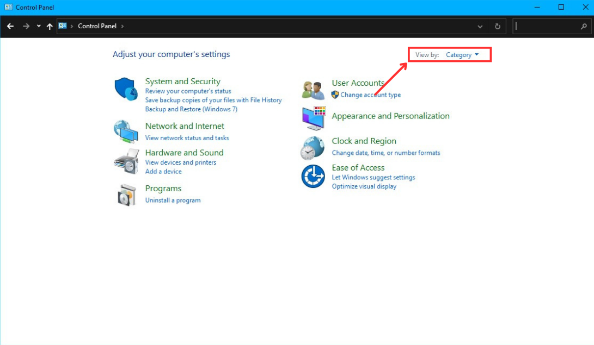
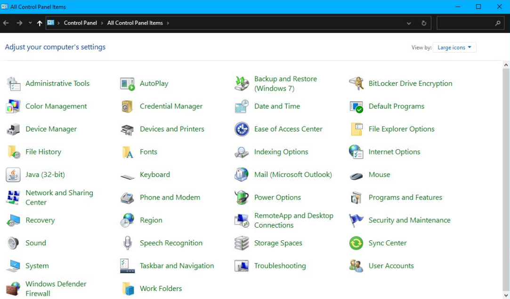
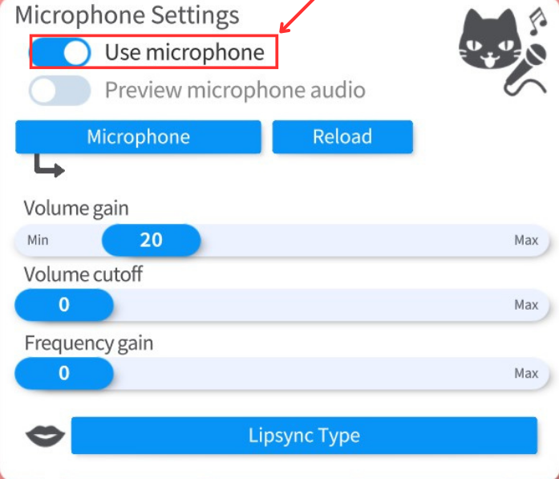
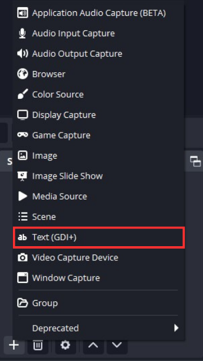
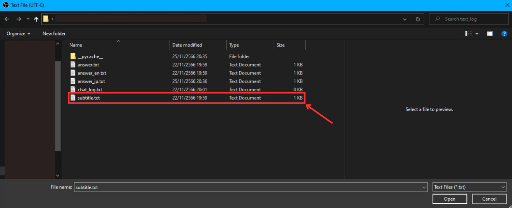
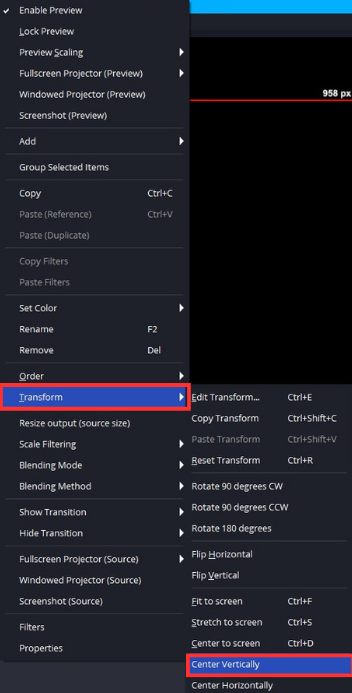
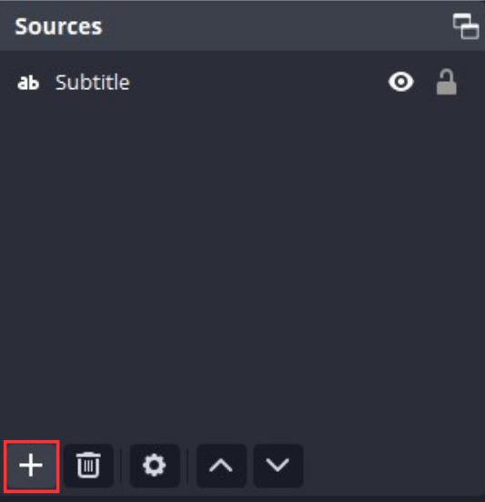
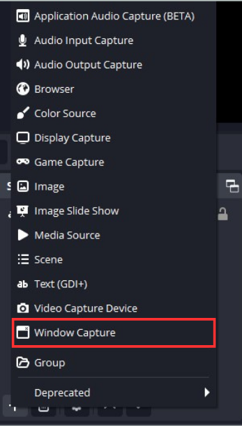
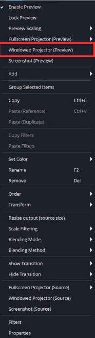
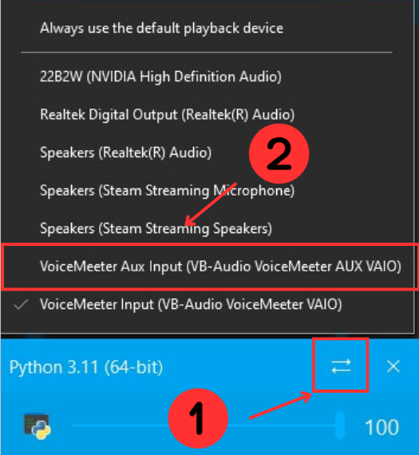

# VirtuAI-Helper

VirtuAI Helper is a python-based program that can execute scripts based on user input or chat with the user. It uses OpenAI API to generate responses with the chatGPT model and VoiceVox engine to synthesize speech in Japanese. The scripts that VirtuAI Helper can execute are multimedia functions such as play/pause media, turn up/down the volume, capture the screen, etc. and web functions such as open Facebook, YouTube, Twitter, etc. The program can receive input in two ways text input or voice input. For text input it can recive input in any language but for voice input it can only recognize English language.


## Table of Contents

- [VirtuAI-Helper](#virtuai-helper)
  - [Features](#features)
  - [Prerequisites](#prerequisites)
  - [Installation](#installation)
  - [File Structure](#file-structure)
  - [Configuration](#configuration)
  - [Usage](#usage)
  - [Use this code with obs and Vtuber studio](#use-this-code-with-obs-and-vtuber-studio)
  - [Contributing](#contributing)
    - [Bug Reports and Feature Requests](#bug-reports-and-feature-requests)
    - [Pull Requests](#pull-requests)
  - [Note](#note)
  - [License](#license)
  - [Credits](#credits)

## Features

- **Script Execution** You can use text or voice commands to execute scripts that perform various tasks on your device or on the web. For example, you can say “play music” or “open YouTube” and the program will execute the corresponding script.
- **Chat Mode** You can use text or voice input to chat with the program. The program will use OpenAI API to generate responses with the chatGPT model and VoiceVox engine to synthesize speech in Japanese. For example, you can say “how are you” or “tell me a joke” and the program will reply accordingly.
- **Voice Input** You can use voice input to interact with the program by pressing and holding the microphone button. The program will use AssemblyAI API to convert your speech-to-text and process it accordingly. For example, you can say “capture the screen” or “what is the weather today” and the program will execute the script or generate the response.

## Prerequisites

- **Python** 3.11 if you didn't have it download it from [here](https://www.python.org/downloads/).
- **Voicevox software** Version 0.14.7 or higher if you didn't have it download it from [here](https://voicevox.hiroshiba.jp/), installed and running.
- **API keys** from OpenAI and AssemblyAI, you can get it from here [OpenAI](https://platform.openai.com/api-keys), [AssemblyAI](https://www.assemblyai.com/app/account).
- Open Broadcaster Software (_if you want the program to show the subtitle file_) if you didn't have it download it from [here](https://obsproject.com/).
- Vtuber Studio, VoiceMeeter banana and EarTrumpet (_if you want the program to show virtual live2d_) if you didn't have it download it from [Vtuber Studio](https://denchisoft.com/), [VoiceMeeter banana](https://vb-audio.com/Voicemeeter/banana.htm), [EarTrumpet](https://eartrumpet.app/).

## Installation

Follow these steps to install and set up VirtuAI Helper.

1. Download the project zip file from GitHub or Clone this repository by typing these in terminal or command prompt (but if you choose to download the project as a zip file you'll also need to extract the zip file).
   ```
   git clone https://github.com/ZeroMirai/VirtuAI-Helper.git
   ```
    
3. Open a terminal or command prompt and change the directory to the project folder by typing `cd` followed by where this folder is located for example `cd C:\Git_hub\VirtuAI Helper`.
4. Install all necessary library by typing.
   ```
   pip install -r requirements.txt
   ```
7. Configure the necessary API keys and other config in config.txt.

## File Structure

- `functions folder`: Contains modular components of the project.
  - `chatgpt_interaction.py`: Handles interactions with the OpenAI GPT model.
  - `condition.py`: Script execution if user input is match conditions.
  - `record_voice.py`: voice recording function.
  - `text_processing_utils.py`: Utilities for all script to processing text.
  - `text_to_speech_utils.py`: Utilities for text-to-speech part.
  - `voice_recognition.py`: Implements speech-to-text using the AssemblyAI API.
- `text_log folder`: Stores various text logs and files.
- `main.py`: Main script for executing the VirtuAI Helper program.
- `config.txt`: File to store various configuration and API keys.
- `prompt.txt`: File to store user prompts.
- `recording.wav.txt`: Transript from speech-to-text.
- `requirements.txt`: File to Install all necessary library.
- `JP_Voice.wav`: A generated text-to-speech file.
- `recording.wav`: Audio recording file.

## Configuration

Before running the program, Ensure you have changed all the configurations and **pasted them right after the : in the file**. The file must have the following format.
  ```
  openAI_api_key:sk-xxxxxxxxxxxxxxxxxxxxxxxxxxxxxxxx
  assembly_api_key:xxxxxxxxxxxxxxxxxxxxxxxxxxxxxxxx
  assistant_name:xxxx
  voice_vox_text_to_speech_model:xx
  ```

- Edit the config.txt file with your OpenAI and AssemblyAI API keys and other config.
  - For openAI_api_key copy and paste your openAI API key here but if you didn't have it, you can get it [here](https://platform.openai.com/api-keys).
  - For assembly_api_key copy and paste your AssemblyAI API key here but if you didn't have it, you can get it [here](https://www.assemblyai.com/app/account).
  - For assistant_name type your desired assistant name (it doesn't affect anything in the code //it's just a text that will show before the answer).
  - For voice_vox_text_to_speech_model you can compare speaker.json name with [VoiceVox](https://voicevox.hiroshiba.jp/) and type id number you desire.
- you can create your own AI personality by changing the prompt in the `prompt.txt` **but don't change the rule part** (if you are too lazy to write your own prompt you can also ask chatGPT to make your own one by asking).
  ```
  Generate me a prompt so I can use with my AI assistant "that's a ..(personality,gender,traits).., ..(other personality,gender,traits).."
  ```

## Usage

To use VirtuAI Helper.

1. Open a terminal or command prompt and change the directory to the project folder by typing `cd` followed by where this folder is located for example `cd C:\Git_hub\VirtuAI Helper`.
2. Open VoiceVox engine.
3. Run the program using.
   ```
   python main.py
   ```
5. Choose between text input (1) or voice input (2).
6. Follow on-screen prompts and interact with VirtuAI Helper.

---
## Use this code with obs and Vtuber studio

You can use this code with OBS to show the subtitle and use Vtuber studio to show Live2D by following this guide.


1. Download [OBS](https://obsproject.com/), [Vtuber studio](https://denchisoft.com/), [EarTrumpet](https://eartrumpet.app/), [VoiceMeeter banana](https://vb-audio.com/Voicemeeter/banana.htm)(after you install VoiceMeeter banana you'll also need to restart your PC) and open VoiceVox.
2. For VoiceMeeter banana, we need to change voice output and voice input first.
   1. Open the Control Panel by pressing the `Windows key` and typing `Control Panel`. In the upper right corner, click on `View by` and select `Large icon`.
      
      
   3. Click on `Sound`, scroll down until you see `VoiceMeeter Input`, and then click on it. Finally, click `Set Default`.
      
      
   5. Click on `Recording` at the top, scroll down until you see `VoiceMeeter Aux Output`, click on it, and then click `Set Default`. After this step, we'll continue to the VoiceMeeter program.
      
      
   7. The first time the program is opened, it would look like this.
      
      
   9. Click on each `A1` to deselect them on all five panels. Similarly, do the same with `B1`. It should now look like this.

      
      
   11. On the upper right corner, click on `A1` and select your speaker output (WDM is recommended).
      

   13. Now, click on `A1` for all VIRTUAL INPUTS. However, for VOICEMEETER AUX, you'll also need to click on `B1`.
      

3. For Vtuber Studio.
   1. Open the settings by double-clicking on the screen and then click on the gear icon located on the left side.
      
      
   3. Scrolldown until you see `Microphone Setting` check `Use microphone` and select `VoiceMeeter Output (VB-Audio VoiceMeeter VAIO)` by clicking on the `Microphone`.
      
      
   5. Go to Model setting at the top left corner(a people icon with a gear). Scroll down until you see `Mouth Open`. Click on `input` and select or type `VoiceVolumePlusMouthOpen`.
      
      
   7. **Optional**: In `Microphone Setting`, I recommend setting `Volume gain` to 20 and everything else is set to 0.
4. For OBS, we'll add subtitles to display the text, and for Vtuber studio, we'll use it to show Live2D.
   1. To add a subtitle, press `+` in the source, select `Text(GDI+)`, and name it as `Subtitle`.
      
      
   3. After adding the text source, a window will appear like this. You'll need to check `Read from file` and then click `Browse`.
      
      
   5. Navigate to `subtitle.txt`, which is located inside the `text_log` folder, and select it.
      
      
   7. Customize and configure the subtitle file according to your preferences, (For my recommendation, I suggest reducing the size of the text, setting `Alignment` to center and `Verticle alignment` to center, right-clicking on the text, navigating to `Tranform` and selecting `Center Horizontally`. Also, check `Outline`, set the outline size to 10-14, and change the outline color to black by clicking on `Select color`).
      
      
   9. To add Vtuber Studio, press `+` in the source, select `Window Capture` and name it as `Live2D`
      
      
   11. After adding the video source, a window will appear like this. Click on `Window`, select `[VTube Studio.exe]: VTube Studio`, on `Capture Method` choose `Windows 10 (1903 and up)`, and then click `OK`.
       
       
   13. Right-click on the preview screen, choose `Windowed Projector (Preview)`, and resize it as your desire.
       
       
   15. **Optional**: To change the preview size, go to `File` in the upper left corner, click `Setting` and clck `Video`. In the Video panel, adjust both `Base (Canvas) Resolution` and `Output (Scaled) Resolution` to `960x1080` (which is half the size of a standard PC monitor, 1980x1080), Resize Vtuber Studio to match the resolution you have set. Finally, go to `Tranform` and align all items to `Center Horizontally`Optionally, you can set the preview projector to always be on top by going to `setting` -> `general` and finding `Make projectors always on top`.
5. Running the code, open EarTrumpet and scroll down to the bottom you'll see `VoiceMeeter Input (VB-Audio VoiceMeeter VAIO)`, right click on `Python 3.11.xx` and click on `change` icon, select `VoiceMeeter Aux Input (VB-Audio VoiceMeeter AUX VAIO)`.
   
   
7. Change your `playback/output device` by clicking on the speaker icon on the taskbar (or go to `window setting` -> `System` -> `Sound` -> `Choose your output device`). Select `VoiceMeeter Aux Input (VB-Audio VoiceMeeter AUX VAIO)` first and then selcet `VoiceMeeter Input (VB-Audio VoiceMeeter VAIO)` (we need to do this process to let Python recognize these playback devices).
   
   
9. In Vtuber Studio, open the settings, navigate to `Microphone Setting` and click on `Reload`.
10. Enjoy! your AI assistant!

---
## Contributing

VirtuAI Helper is a project created for fun, if you are interested to contribute in this project here is how you can make this project better for everyone.

### Bug Reports and Feature Requests

If you found a bug or have an idea for a new feature, feel free to requests and reports by [open an issue](https://github.com/ZeroMirai/VirtuAI-Helper/issues) on GitHub and post it if it's a bug please give as much detail as possible or suggest an idea please include a step or a clear description.

### Pull Requests

If you have suggestions or improvements.

1. Fork the repository and create your own branch from `main`.
2. Work on your changes.
3. Write clear, concise commit messages that describe the purpose of your changes.
4. Open a pull request and provide a detailed description of your changes.

I'm primarily looking for code improvements and bug fixes. Once your changes are approved, they will be merged into the main project.

### Share and Give a Star

**If you find this project useful I would be really grateful if you could consider sharing this small project with others and giving it a star on GitHub.**

---

## Note

- Ensure that you have the required dependencies and configuration set up before running the code.
- Running the program and VoiceVox engine simultaneously is necessary for proper program functionality.
- If you use this program with OBS and Vtuber Studio, you need to redo steps 5-8 every time the program is opened.
- For text input it can recive input in any language but for voice input it can only recognize English language.
- If text in obs is not showing, make sure  you place the Subtitle source above the Live2D source.

## License

This project is licensed under the [MIT License](LICENSE).

## Credits

- **OpenAI** - I used [OpenAI API](https://openai.com/) to generate responses with the chatGPT model.
- **Voicevox** by Hiroshiba - I used [VoiceVox Engine](https://voicevox.hiroshiba.jp/) to synthesize speech in Japanese.
- **AssemblyAI API** - I used [AssemblyAI API](https://www.assemblyai.com/) to convert speech to text.
- **PyAutoGUI** - I used [PyAutoGUI](https://pyautogui.readthedocs.io/en/latest/) to perform multimedia tasks such as playpause media, turn updown the volume, and capture the screen.
- **Webbrowser**- I used [Webbrowser](https://docs.python.org/3/library/webbrowser.html) to open websites such as Facebook, YouTube, and Twitter.
