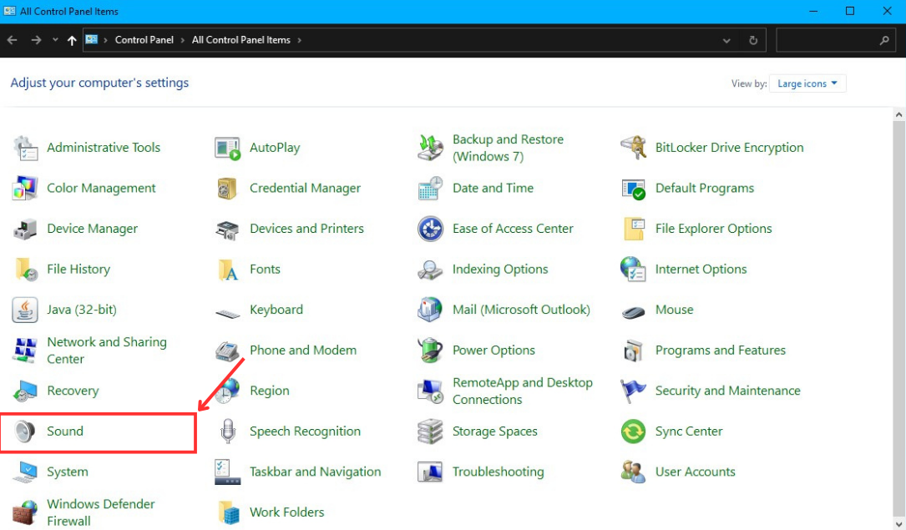
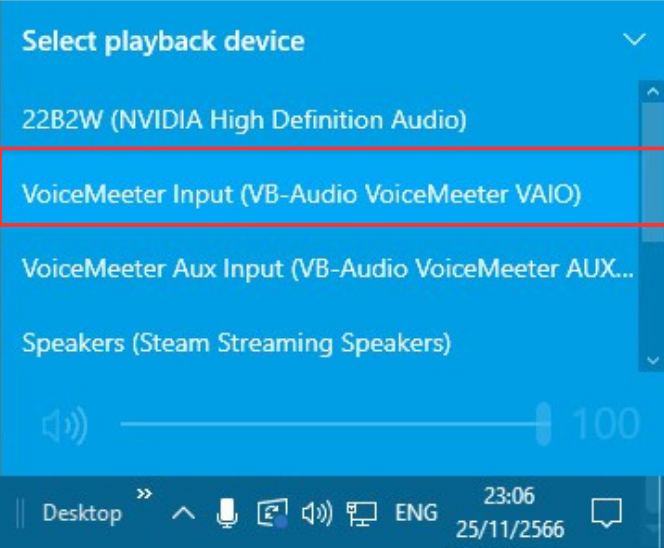

## Use this code with obs and Vtuber studio

You can use this code with OBS to show the subtitle and use Vtuber studio to show Live2D by following this guide.

1. Download [OBS](https://obsproject.com/), [Vtuber studio](https://denchisoft.com/), [EarTrumpet](https://eartrumpet.app/), [VoiceMeeter banana](https://vb-audio.com/Voicemeeter/banana.htm)(after you install VoiceMeeter banana you'll also need to restart your PC) and open VoiceVox.
2. For VoiceMeeter banana, we need to change voice output and voice input first.
   1. Open the Control Panel by pressing the `Windows key` and typing `Control Panel`. In the upper right corner, click on `View by` and select `Large icon`.
      
      
   3. Click on `Sound`, scroll down until you see `VoiceMeeter Input`, and then click on it. Finally, click `Set Default`.
      
      
   5. Click on `Recording` at the top, scroll down until you see `VoiceMeeter Aux Output`, click on it, and then click `Set Default`. After this step, we'll continue to the VoiceMeeter program.
      
      
   7. The first time the program is opened, it would look like this.
      
      
   9. Click on each `A1` to deselect them on all five panels. Similarly, do the same with `B1`. It should now look like this.

      
      
   11. On the upper right corner, click on `A1` and select your speaker output (WDM is recommended).
      

   13. Now, click on `A1` for all VIRTUAL INPUTS. However, for VOICEMEETER AUX, you'll also need to click on `B1`.
      

3. For Vtuber Studio.
   1. Open the settings by double-clicking on the screen and then click on the gear icon located on the left side.
      
      
   3. Scrolldown until you see `Microphone Setting` check `Use microphone` and select `VoiceMeeter Output (VB-Audio VoiceMeeter VAIO)` by clicking on the `Microphone`.
      
      
   5. Go to Model setting at the top left corner(a people icon with a gear). Scroll down until you see `Mouth Open`. Click on `input` and select or type `VoiceVolumePlusMouthOpen`.
      
      
   7. **Optional**: In `Microphone Setting`, I recommend setting `Volume gain` to 20 and everything else is set to 0.
4. For OBS, we'll add subtitles to display the text, and for Vtuber studio, we'll use it to show Live2D.
   1. To add a subtitle, press `+` in the source, select `Text(GDI+)`, and name it as `Subtitle`.
      
      
   3. After adding the text source, a window will appear like this. You'll need to check `Read from file` and then click `Browse`.
      
      
   5. Navigate to `subtitle.txt`, which is located inside the `text_log` folder, and select it.
      
      
   7. Customize and configure the subtitle file according to your preferences, (For my recommendation, I suggest reducing the size of the text, setting `Alignment` to center and `Verticle alignment` to center, right-clicking on the text, navigating to `Tranform` and selecting `Center Horizontally`. Also, check `Outline`, set the outline size to 10-14, and change the outline color to black by clicking on `Select color`).
      
      
   9. To add Vtuber Studio, press `+` in the source, select `Window Capture` and name it as `Live2D`
      
      
   11. After adding the video source, a window will appear like this. Click on `Window`, select `[VTube Studio.exe]: VTube Studio`, on `Capture Method` choose `Windows 10 (1903 and up)`, and then click `OK`.
       
       
   13. Right-click on the preview screen, choose `Windowed Projector (Preview)`, and resize it as your desire.
       
       
   15. **Optional**: To change the preview size, go to `File` in the upper left corner, click `Setting` and clck `Video`. In the Video panel, adjust both `Base (Canvas) Resolution` and `Output (Scaled) Resolution` to `960x1080` (which is half the size of a standard PC monitor, 1980x1080), Resize Vtuber Studio to match the resolution you have set. Finally, go to `Tranform` and align all items to `Center Horizontally`Optionally, you can set the preview projector to always be on top by going to `setting` -> `general` and finding `Make projectors always on top`.
5. Running the code, open EarTrumpet and scroll down to the bottom you'll see `VoiceMeeter Input (VB-Audio VoiceMeeter VAIO)`, right click on `Python 3.11.xx` and click on `change` icon, select `VoiceMeeter Aux Input (VB-Audio VoiceMeeter AUX VAIO)`.
   
   
7. Change your `playback/output device` by clicking on the speaker icon on the taskbar (or go to `window setting` -> `System` -> `Sound` -> `Choose your output device`). Select `VoiceMeeter Aux Input (VB-Audio VoiceMeeter AUX VAIO)` first and then selcet `VoiceMeeter Input (VB-Audio VoiceMeeter VAIO)` (we need to do this process to let Python recognize these playback devices).
   
   
9. In Vtuber Studio, open the settings, navigate to `Microphone Setting` and click on `Reload`.
10. Enjoy! your AI assistant!
